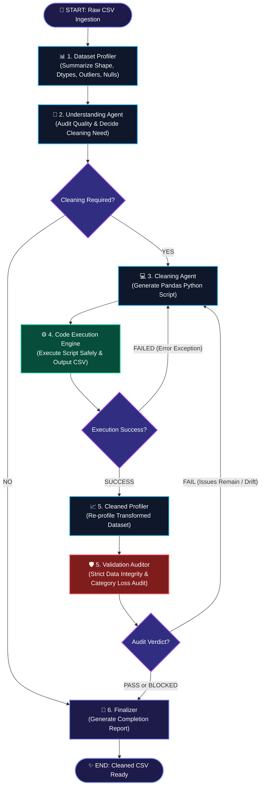
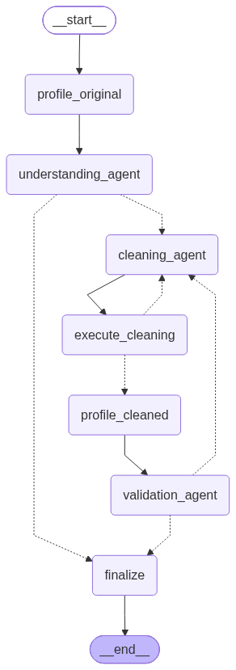

# 🤖 AutoClean AI: Autonomous Multi-Agent Data Cleaning Pipeline

[](https://share.streamlit.io/)
[](https://www.python.org/downloads/)
[](https://github.com/langchain-ai/langgraph)
[](https://groq.com/)
[](https://opensource.org/licenses/MIT)

> **AutoClean AI** is an enterprise-grade autonomous multi-agent data cleaning pipeline built with **LangGraph**, **ChatGroq**, and **Streamlit**. It observes, analyzes, writes Python pandas transformation code, executes it in a sandbox, and strictly audits data integrity through a self-healing feedback loop.

---

## 🌟 Visual Workflow Architecture



<p align="center">
  
</p>

---

## 🔍 In-Depth Workflow Breakdown

### 1. 📊 Dataset Profiler (`summarize_csv`)
- Computes structural statistics under a strict LLM token budget.
- Evaluates:
  - Row and column count, memory footprint.
  - Column null counts and missing percentages.
  - Duplicate record detection.
  - Constant column detection (zero variance).
  - IQR-based numeric outlier identification and skewness.
  - High cardinality and string length profiles.
  - Mixed-type identification (e.g. numeric columns formatted with strings or `$`).
  - Potential datetime strings formatted in inconsistent structures.

### 2. 🧠 Understanding Agent
- Acts as the chief data scientist.
- Scans the profiler output to determine whether cleaning is required without modifying data arbitrarily.
- **Rule Enforcement**: Conservative cleaning policy—prevents dropping valid categories or genuine extreme values.
- Outputs an in-depth diagnosis and a strict decision flag:
  - `CLEANING_REQUIRED: YES` or `CLEANING_REQUIRED: NO`.

### 3. 💻 Cleaning Agent
- Acts as an expert Python data engineer.
- Ingests the original profile, current profile, initial understanding report, and validation feedback history.
- Produces production-ready, fully commented pandas code targeting `cleaned_output.csv`.
- **Integrity Guardrails**:
  - Never drops rows without clear justification.
  - Never converts genuine categories to numeric.
  - Preserves column naming unless explicitly justified.

### 4. ⚙️ Code Execution Engine
- Safely executes the generated code locally using an isolated execution scope.
- Validates that:
  - The script executes with zero exceptions.
  - `cleaned_output.csv` is produced.
  - The resulting dataset is non-empty and readable by pandas.
- If an error occurs, it feeds back runtime traceback directly into the cleaning agent.

### 5. 🛡️ Validation Auditor
- Acts as a strict data quality auditor.
- Compares the original dataset with the current cleaned dataset:
  - Verifies missing values are eliminated.
  - Verifies duplicates are eliminated.
  - Asserts **zero unintentional loss of valid categorical values**.
  - Asserts **zero unintentional loss of genuine rows/columns**.
- Emits:
  - `VALIDATION_STATUS: PASS`
  - `VALIDATION_STATUS: FAIL` (triggers autonomous correction loop)
  - `VALIDATION_STATUS: BLOCKED` (stops workflow if safe automation is impossible)

### 6. 🏁 Finalizer
- Prepares the final audit log, summary of improvements, and flags completion for the user interface.

---

## ✨ Streamlit Interactive Web Application Features

1. **Animated Pipeline Stepper**:
   - Live visual status indicator highlighting the currently active node with glowing pulse borders and completion checkmarks.
2. **Step-by-Step Agent Output Tabs**:
   - Inspect raw profiler summaries, LLM thoughts, generated Python cleaning code with syntax highlighting, execution logs, and validator reports.
3. **Before vs. After CSV Comparison**:
   - **Metrics Row**: Total rows delta, columns delta, missing values eliminated (percentage improvement), and duplicate count.
   - **Tabbed Views**: Raw dataset table, cleaned dataset table, and column-by-column transformation quality matrix.
4. **Artifact Downloads**:
   - Download cleaned CSV (`cleaned_output.csv`).
   - Download generated Python script (`cleaning_script.py`).
   - Download complete audit report (`cleaning_audit_report.md`).
5. **Instant Demo Dataset**:
   - One-click button to load a realistic messy customer dataset with corrupted dates, mixed types, missing records, and duplicate IDs.

---

## 🚀 Deployment to Streamlit Community Cloud

Deploy your own live instance of AutoClean AI in under 2 minutes:

### Step 1: Push Code to GitHub
Ensure all repository files are committed and pushed:
```bash
git init
git remote add origin https://github.com/PARAS-BYTE/DATA-CLEANING-AUTOMATION.git
git add .
git commit -m "feat: complete multi-agent data cleaning streamlit application"
git branch -M main
git push -u origin main
```

### Step 2: Connect to Streamlit Community Cloud
1. Go to [share.streamlit.io](https://share.streamlit.io/) and sign in with GitHub.
2. Click **New app**.
3. Select your repository: `PARAS-BYTE/DATA-CLEANING-AUTOMATION`.
4. Branch: `main`.
5. Main file path: `app.py`.

### Step 3: Configure Secrets (Groq API Key)
1. In the Streamlit deployment settings, open **Advanced settings** -> **Secrets**.
2. Add your Groq API key:
   ```toml
   GROQ_API_KEY = "gsk_your_groq_api_key_here"
   ```
3. Click **Deploy!**

---

## 💻 Local Installation & Setup

### Prerequisites
- Python 3.10 or higher
- A Groq Cloud API key ([Get one free at console.groq.com](https://console.groq.com/))

### Installation
```bash
# 1. Clone the repository
git clone https://github.com/PARAS-BYTE/DATA-CLEANING-AUTOMATION.git
cd DATA-CLEANING-AUTOMATION

# 2. Create and activate a virtual environment
python -m venv venv
# On Windows:
.\venv\Scripts\activate
# On macOS/Linux:
source venv/bin/activate

# 3. Install required packages
pip install -r requirements.txt

# 4. (Optional) Set your Groq API Key environment variable
# PowerShell:
$env:GROQ_API_KEY="your_api_key_here"
# Bash:
export GROQ_API_KEY="your_api_key_here"

# 5. Launch the Streamlit application
streamlit run app.py
```

---

## 📂 Project Structure

```text
├── app.py                  # Main Streamlit web application & animated UI
├── cleaning_engine.py      # Core LangGraph multi-agent engine & streaming generator
├── sample_data.py          # Demo messy dataset generator
├── something.py            # Original autonomous multi-agent pipeline script
├── requirements.txt        # Production dependencies for Streamlit Cloud
├── .gitignore              # Git ignore rules for clean repository
├── sample_dirty_data.csv   # Generated demo messy dataset
└── README.md               # Project documentation & workflow architecture
```

---

## 📜 License

This project is licensed under the MIT License - see the [LICENSE](LICENSE) file for details.
